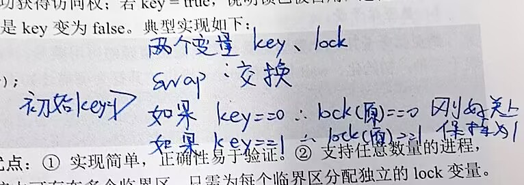

# 同步、互斥与通信 — 专题笔记

[← 操作系统知识地图](./MOC.md)

---

## 基本概念

| 术语     | 定义                                                   |
| -------- | ------------------------------------------------------ |
| 临界资源 | 同一时刻只允许一个进程访问（打印机、共享变量、缓冲区） |
| 临界区   | 访问临界资源的代码段                                   |
| 同步     | 约束执行顺序——"谁先谁后"，信号量初值通常 0           |
| 互斥     | 排他访问——"不能同时进"，信号量初值通常 1             |

| 准则     | 含义                 | 违反后果  |
| -------- | -------------------- | --------- |
| 空闲让进 | 空着就放行           | 利用率低  |
| 忙则等待 | 有人就排队           | 互斥失效  |
| 有限等待 | 不能无限排           | 饥饿/死锁 |
| 让权等待 | 进不去就挂起，别空转 | CPU 浪费  |

---

## 软件方案

| 方案               | 机制                        | 致命问题                                 |
| ------------------ | --------------------------- | ---------------------------------------- |
| 单标志法           | `turn` 轮流               | 对方不想进时自己也不能进 → 违背空闲让进 |
| 双标志先检查       | 先看对方，再设自己          | 检查与置位非原子 → 可能同时进           |
| 双标志后检查       | 先设自己，再看对方          | 双方都设了标志又互等 → 死锁             |
| **Peterson** | `flag[2]` + `turn` 谦让 | 满足前三准则，但用忙等待 → 缺让权等待   |

```c
// Peterson — Pi 进入
flag[i] = true;
turn = j;
while (flag[j] && turn == j);   // 对方想进且轮到对方 → 等
// 临界区
flag[i] = false;
```

---

## 硬件方案

| 方案         | 做法                                           | 问题                                    |
| ------------ | ---------------------------------------------- | --------------------------------------- |
| 关中断       | 单 CPU 关中断不调度                            | 多 CPU 无效、关太久影响响应、仅内核可用 |
| Test-and-Set | 原子读锁并置 true，返回 false = 获锁(原未加锁) | 忙等待                                  |
| Swap         | `swap(key, lock)`，交换后 key=false = 获锁   | 忙等待                                  |



|          | 自旋锁                           | 互斥锁   |
| -------- | -------------------------------- | -------- |
| 等待方式 | CPU 空转                         | 阻塞挂起 |
| 让权等待 | ❌                               | ✅       |
| 适用     | 临界区极短、多核、不可睡眠上下文 | 临界区长 |

---

## 信号量

|      | P (wait/down)                  | V (signal/up)                  |
| ---- | ------------------------------ | ------------------------------ |
| 行为 | 申请资源，减信号量，不足则阻塞 | 释放资源，增信号量，唤醒等待者 |
| 来源 | 荷兰语_proberen_（测试）       | 荷兰语_verhogen_（增加）       |

|          | 整型                   | 记录型                    |
| -------- | ---------------------- | ------------------------- |
| 结构     | `int S`              | `int value` + 等待队列  |
| P 操作   | `while (S<=0); S--;` | `S--; if(S<0) block();` |
| 等待方式 | 忙等                   | 阻塞                      |
| 让权等待 | ❌                     | ✅                        |

```c
typedef struct { int value; queue L; } semaphore;
void wait(semaphore *S) { S->value--; if (S->value < 0) block(S->L); }
void signal(semaphore *S) { S->value++; if (S->value <= 0) wakeup(S->L); }
// value: >0 = 可用数, <0 = |等待进程数|
```

| 用途     | 初值       | 模式                                 | 口诀                   |
| -------- | ---------- | ------------------------------------ | ---------------------- |
| 互斥     | 1          | `P(mutex)` …临界区… `V(mutex)` | —                     |
| 同步     | 0          | 前驱后 `V`，后继前 `P`           | —                     |
| 前驱关系 | 每边一个 0 | 边起点后 `V`，边终点前 `P`       | 等前面→P，放行后面→V |

```
S1 → S2 → S4
  ↘ S3 ↗
```

```c
semaphore a=0,b=0,c=0,d=0;
S1; V(a); V(b);
P(a); S2; V(c);
P(b); S3; V(d);
P(c); P(d); S4;
```

---

## 经典问题

### 生产者-消费者,临界区只能有一个

```c
semaphore mutex=1, empty=N, full=0;   // 互斥 + 空位数 + 满位数

producer() {
    produce;
    P(empty);           // 先同步：等空位
    P(mutex);           // 再互斥
    put;
    V(mutex);
    V(full);            // 放行消费者
}
consumer() {
    P(full);            // 等满位
    P(mutex);
    take;
    V(mutex);
    V(empty);           // 放行生产者
    consume;
}
// ⚠️ P顺序不能换：先P(同步)再P(mutex)，否则满时生产者持锁等empty → 消费者等锁 → 死锁
```

### 读者-写者

```c
int readcount = 0;
semaphore mutex = 1, rw = 1;

reader() {
    P(mutex);
    if (++readcount == 1) P(rw);  // 第一个读者锁文件
    V(mutex);
    读;
    P(mutex);
    if (--readcount == 0) V(rw);  // 最后读者放文件
    V(mutex);
}
writer() { P(rw); 写; V(rw); }
// 读者优先：读者源源不断 → 写者饥饿
// 写者优先：有写者在等时阻新读者插队，额外加 w 信号量
```

### 哲学家进餐

死锁条件：5 人同时拿左边等右边 → 环形等待。

| 避免方案 | 做法                   | 打破哪条死锁条件 |
| -------- | ---------------------- | ---------------- |
| 限制人数 | 最多 4 人同时拿筷      | 不剥夺           |
| 奇偶策略 | 奇先左后右，偶先右后左 | 环路等待         |
| 一次拿俩 | mutex 保护取筷，原子化 | 保持并等待       |

---

## 管程

|      | 信号量                | 管程                   |
| ---- | --------------------- | ---------------------- |
| 互斥 | 程序员手写 P/V        | 编译器/运行时自动      |
| 风险 | P/V 忘写/配错 → 死锁 | 低                     |
| 结构 | 分散                  | 封装（数据+操作+同步） |

| 条件变量操作   | 行为                         |
| -------------- | ---------------------------- |
| `wait(cv)`   | 阻塞当前进程，释放管程互斥权 |
| `signal(cv)` | 唤醒 cv 上一个等待者         |

> 管程 = 共享数据 + 互斥访问 + 等待唤醒，统一封装。信号量是手动挡，管程是自动挡。
