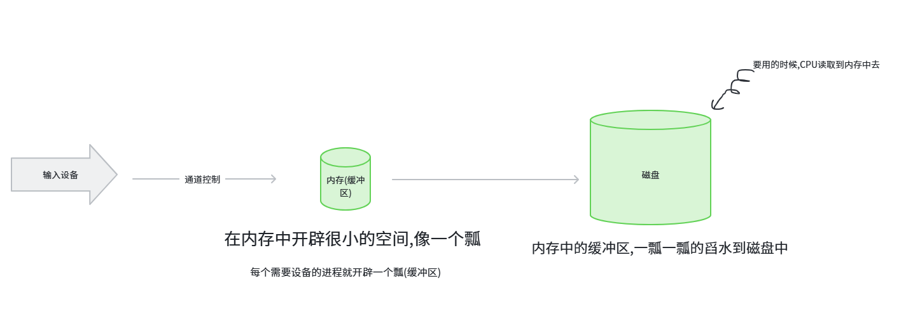

# 输入输出管理

[← 操作系统知识地图](./MOC.md)

---

### 输入输出管理主要功能包括:

1. **设备管理**: 管理各类外设并向上提供统一接口
2. **设备分配与回收**: 协调多个进程对设备的使用
3. **缓冲管理**: 缓和 `CPU`、内存和外设之间的速度差异
4. **I/O 控制**: 决定采用轮询、中断、`DMA` 还是通道方式传输数据
5. **磁盘管理**: 管理磁盘结构、分区、坏块、存取时间和调度

### 设备控制方式:

1. **程序直接控制**: `CPU` 轮询设备状态, 效率最低
2. **中断驱动方式**: 设备完成后发中断, 减少 `CPU` 空等
3. **DMA 方式**: 由 `DMA` 控制器在设备和内存间直接传数据, `CPU` 只负责发起和结束
4. **通道控制方式**: 通道负责更复杂的 `I/O` 控制, `CPU` 干预最少

### 缓冲管理:

缓冲的作用是缓和速度不匹配, 减少 `CPU` 等待。

1. **单缓冲**: 一个缓冲区, 设备和进程仍可能互相等待
2. **双缓冲**: 两个缓冲区交替工作, 可边输入边处理
3. **循环缓冲**: 多个缓冲区首尾相连, 适合连续数据流
4. **缓冲池**: 统一管理多个缓冲区, 适合多进程并发 `I/O`

**缓冲** 解决传输速度不匹配, **缓存** 解决重复访问。

可以参考[缓冲区的代码](../../库中车马多如簇/缓冲区/MOC.md)怎么写

### 设备分配与回收:

设备管理常用的数据结构:

1. **SDT**: 系统设备表,比DCT记录的内容少点,一个设备对应一个,用来索引
2. **DCT**: 设备控制表,记录属性如(设备状态,指向控制器表的指针,重复执行次数或时间,设备队列首指针)
3. **COCT**: 控制器控制表,记录与设备控制器连接的设备的信息
4. **CHCT**: 通道控制表,记录与通道链接的设备的通道的信息

**独占设备** 一次只能分给一个进程, **共享设备** 可由系统协调多个进程使用, **虚拟设备** 常通过 `Spooling` 把独占设备改造成逻辑共享设备。

### SPOOLING技术:

用户进程发起 I/O 请求，SPOOLing 系统在磁盘上为其分配合适的 **输入/输出井** ，并在内存中开辟极小的 **缓冲区** 。

**输入时** ：通道将外设数据读入内存缓冲区，满后立刻刷新到磁盘输入井.**输出时** ：进程迅速将数据扔进磁盘输出井，随后便可释放。

**输入时** ：CPU/进程需要时，通道将数据从磁盘输入井**高速秒读**到目标内存.**输出时** ：通道在后台默默地将磁盘输出井的文件逐个送往物理设备（如打印机）去处理。

如果没有SPOOLING,就需要在内存中开辟大空间等待传输,即使用双缓冲减小空间,也无法适应多进程

### 磁盘:

用在数据中心和云端.

**磁道** 是盘面上的同心圆, **扇区** 是磁道划分出的区段, **柱面** 是多个盘面上半径相同的磁道集合。

**分区** 是对磁盘的逻辑划分, 便于安装不同文件系统和管理数据。

**引导块** 位于磁盘起始区域, 保存启动相关信息。

**坏块** 是无法可靠读写的磁盘块, 需要屏蔽或重映射。

### 磁盘存取时间:

$$
存取时间 = 寻道时间 + 旋转延迟 + 传输时间
$$

其中 **寻道时间** 往往占主要部分, 所以磁盘调度算法主要目标是减少磁头移动。

### 磁盘调度算法:

1. **FCFS**: 先来先服务, 公平但平均寻道时间较长
2. **SSTF**: 优先处理最近请求, 性能好但可能饥饿
3. **SCAN**: 电梯算法, 磁头往返扫描
4. **LOOK**: 只扫描到当前方向最后一个请求就返回
5. **C-SCAN**: 单向扫描, 等待时间更均匀
6. **C-LOOK**: 单向扫描的改进版, 只在请求范围内移动

### RAID:

`RAID` 用多块磁盘换可靠性和吞吐量。

1. **RAID 0**: 条带化, 快但无冗余
2. **RAID 1**: 镜像, 可靠但空间利用率低
3. **RAID 5**: 条带化加分布式校验, 综合性较强

---
