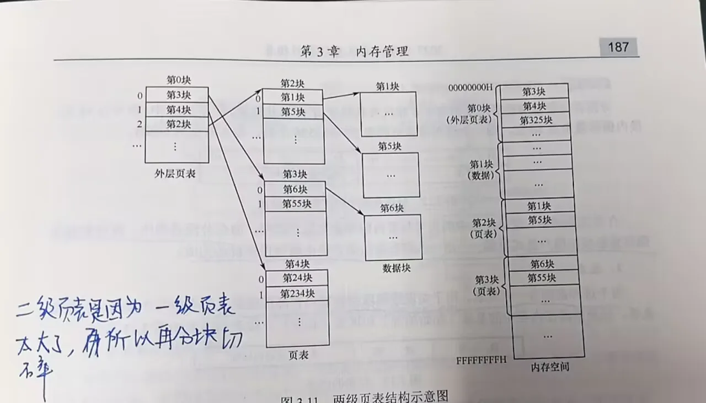

# 页式管理

[← 内存管理](内存管理.md) | [← MOC| ](MOC.md)[← 主页](../../index.md)

---

### 为什么要用页式管理

连续分配要求给进程找一整块连续内存,容易产生外部碎片,而且进程搬动困难。

页式管理把进程的逻辑地址空间切成大小相等的**页**,把内存物理空间切成大小相等的**页框**或**页帧**,装入时不要求连续,只要把若干页分别放进若干空闲页框即可。

它的核心目标是:

1. **离散分配**:进程各部分可以分散装入不同物理位置
2. **减少外部碎片**:不再要求大块连续空间
3. **便于虚拟内存实现**:按页换入换出更加方便

### 基本概念

1. **页(Page)**:进程逻辑地址空间被划分出的固定大小块
2. **页框(Page Frame)**:内存物理空间被划分出的固定大小块
3. **页号**:逻辑地址中用来标识第几页的部分
4. **页内偏移量**:逻辑地址中页内第几个字节的位置

页和页框大小必须相同,这样某一页装入任何一个页框后,页内地址对应关系都不变。

### 页表

页式管理中,进程看到的是连续的逻辑地址,但实际物理内存可能是离散的,所以操作系统需要建立一张**页表**来记录映射关系。

页表的作用就是:

**记录进程逻辑页号 -> 物理页框号的对应关系**

页表一般按进程建立,每个进程有自己独立的页表。页表中的一个表项通常至少包含:

| 字段 | 作用 |
| ---- | ---- |
| **页框号** | 该逻辑页对应的物理页框号 |
| **有效位** | 该页是否已装入内存（为 0 时触发缺页中断） |
| **保护位** | 读写执行权限 |
| **访问位** | 该页近期是否被访问过（置换判断依据） |
| **修改位**（脏位） | 该页是否被写入过（换出时决定是否回写磁盘） |

### 地址变换方法

CPU给出的通常是逻辑地址,在页式管理中,逻辑地址可以拆成两部分:

1. **页号P**
2. **页内偏移量W**

假设页面大小为 $L$,则:

$$
\text{页号}P = \left\lfloor \frac{A}{L} \right\rfloor,\quad \text{页内偏移}W = A \bmod L
$$

其中 $A$ 是逻辑地址。

地址变换过程如下:

1. CPU给出逻辑地址,先拆出页号P和页内偏移量W
2. 用页号P去查页表,找到对应的物理页框号F
3. 把物理页框号F和页内偏移量W拼接起来,得到物理地址

如果按字节编址,物理地址可写成:

$$
\text{物理地址} = F \times L + W
$$

这里可以看出,**页内偏移量不变,变化的是页号对应的页框号**。
所以很多教材会把页式管理的地址变换总结成一句话:

**页内地址不变,页号通过查页表变换为页框号**

> **查找页表是由硬件实现的。** CPU 内部有一个部件叫 **MMU（Memory Management Unit，内存管理单元）**，它负责自动完成「逻辑地址 → 物理地址」的转换。操作系统只负责维护页表内容（建立映射、更新标志位等），真正每次访存时查页表、拼地址的动作，是 MMU 硬件自动做的，不需要软件介入。

### TLB（快表与慢表）

> TLB 即 Translation Lookaside Buffer，中文常译为快表、地址变换旁路缓存。

每次访存都要先查页表，页表本身也在内存中——这意味着一次逻辑地址访问可能变成**两次物理内存访问**（查页表 + 真正访存）。TLB 是 MMU 内部的高速硬件缓存，专门缓存最近用过的页表项。

| | 快表（TLB） | 慢表（页表） |
| ---- | ---- | ---- |
| 位置 | CPU/MMU 内部 | 内存中 |
| 容量 | 很小（几十到几百项） | 很大 |
| 速度 | 极快 | 慢（一次内存访问） |

地址变换流程：

```
1. 先根据页号查 TLB
2. 命中 → 直接得到页框号 → 省掉一次内存访问
3. 未命中 → 查内存中的页表 → 得到页框号 → 更新 TLB
```

### 两级页表

当进程逻辑地址空间很大时,如果每个进程都维护一张完整的大页表,页表本身会占用很多内存。

例如32位系统中,如果页面较小,一个进程可能需要非常多的页表项,即使很多页根本没有使用,对应页表项也得预留出来,造成浪费。

因此引入**多级页表**,最常见的就是**两级页表**。

两级页表的基本思想是:

**把原来的一张大页表再分页,先查外层页表,再查内层页表**


