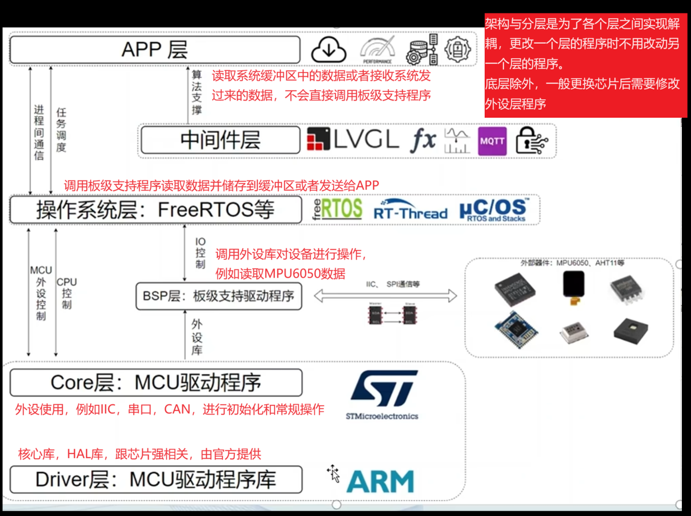

# 嵌入式工程架构 MOC

[← 返回库总览](../MOC.md)

1. [嵌入式项目骨架](嵌入式项目骨架.md),把需求,功能,前期准备,等等做好
2. 设计好层次架构这里,Driver层是MCU厂家提供的库,然后在Core写好最基础的片内外设驱动函数接口供BSP和操作系统调用,	BSP层写调用外设的函数,如果是裸机就跳过OS层,否则OS统一管理中断,
3. 裸机使用[表驱法 笔记](./表驱法.md),操作系统使用[freeRTOS 笔记](./freeRTOS/MOC.md)
4. 外设到[库的MOC](../MOC.md)里去选
