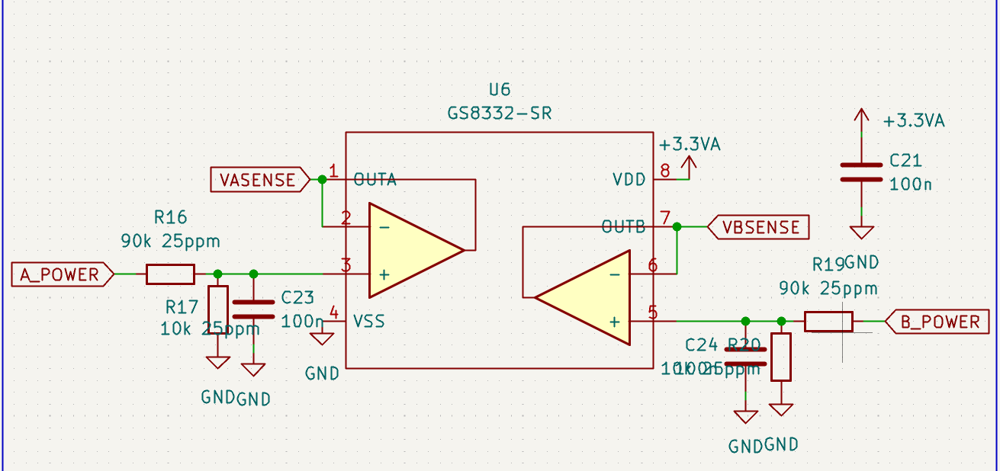

# GS8332-SR 运算放大器

[← 返回 MOC](MOC.md)

---

## 芯片简介

GS8332-SR 是聚洵（Gainsil）的一款双通道、高精度、零漂移（Zero-Drift）运算放大器。

在当前这类电源采样电路里，它的核心作用不是放大，而是作为**电压跟随器 / 缓冲器**，把前级分压后的电压稳定地送给 MCU 的 ADC。

---

## 在这个电路里的作用

可以把它前面的采样链路分成三步理解：

### 1. 分压

输入信号 `A_POWER` 或 `B_POWER` 先经过 `R16=90kΩ` 和 `R17=10kΩ` 的分压网络。

分压后电压为：

$V_{out}=V_{in}\times\frac{10k}{90k+10k}=V_{in}\times\frac{1}{10}$

作用：

- 把 `12V`、`24V` 这类高电压缩小到 ADC 可采样范围
- 给后级运放和 MCU 提供安全的输入电平

### 2. 滤波

`C23=100nF` 和分压网络一起构成简单低通滤波。

作用：

- 滤掉电源线上的高频噪声
- 让采样值更平稳，减小抖动

### 3. 缓冲

运放输出端直接回接反相输入端，这是典型的**电压跟随器**接法。

它的主要价值是：

- **高输入阻抗**：几乎不从分压网络取电流，分压比更稳定
- **低输出阻抗**：可以更稳地驱动 ADC 采样电容
- **隔离前后级**：避免 ADC 采样瞬间拉动前级分压点电压

如果没有这个运放，ADC 内部采样电容充放电时，可能直接把分压点拉偏，导致采样误差。

---

## 为什么选 GS8332-SR

这类电路如果前级已经用了高精度电阻，比如 `25ppm` 电阻，通常说明系统对采样精度和温漂比较敏感。此时选零漂移运放是合理的。

### 零漂移

GS8332-SR 采用斩波稳零类方案，输入失调电压和温漂都比较低。

作用：

- 提高静态采样准确度
- 降低温度变化带来的零点漂移

### 轨到轨输出

如果系统供电是 `3.3V`，轨到轨输出可以让输出尽量覆盖接近 `0V` 到 `3.3V` 的范围。

作用：

- 不轻易压缩 ADC 可用量程
- 更适合单电源采样系统

### 低噪声、适合直流精密采样

对于电池电压、电源母线电压、电流采样放大后的直流量测，这类运放比普通低成本通用运放更稳。

---

## 典型应用场景

- 电池组分压采样
- 电源母线电压监测
- 运放缓冲后送入 MCU ADC
- 配合分流电阻或采样网络做电流/功率监测

---

## 一句话理解

GS8332-SR 在这里本质上是一个**高精度信号调理缓冲器**：

把前级“高阻、易受 ADC 扰动、带噪声”的分压信号，变成“低阻、稳定、适合 ADC 读取”的采样电压。
