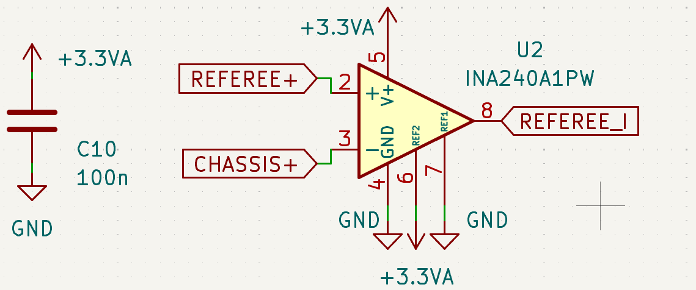

# INA240A1 电流采样放大器

[← 返回 MOC](MOC.md)

---

## 芯片简介

INA240A1 是一款适合高边电流检测的电流采样放大器。

它最突出的特点不是“能测电流”，而是**在强 PWM 开关噪声环境下依然能稳定测流**，很适合 Buck、Boost、四开关 Buck-Boost、电机驱动这类场景。

---

## 这个芯片强在哪里

### 1. 增强型 PWM 抑制

普通电流采样芯片在 MOSFET 高频切换时，容易因为共模电压剧烈跳变导致输出乱跳。

INA240 的核心优势是 **Enhanced PWM Rejection**。

它内部专门针对功率开关切换时的共模扰动做了抑制，所以即使采样点挂在高边、母线电压剧烈变化，输出波形也会更平滑，更接近真实电流包络。

这对下面这些电路尤其关键：

- 电机驱动
- Buck / Boost
- 四开关 Buck-Boost
- 带 PWM 开关的功率回路

### 2. A1 增益档

INA240 有多个固定增益版本，`A1` 表示固定增益为 `20 V/V`。

例如采样电阻上的压降是 `10mV`，放大后输出变化量就是：

$$
10mV \times 20 = 200mV
$$

### 3. 宽共模输入范围

它支持较宽的共模输入范围，适合高边检测。

物理意义是：

- 采样电阻不必放在地线上
- 可以直接测高压母线侧电流
- 即使采样点电位随系统状态变化，芯片也仍然能正常工作

---

## 这张电路里为什么这样接 REF1 和 REF2

这是这类电路里最关键的一点。

### 双向电流采样

如果需要同时测“正向电流”和“反向电流”，不能把输出零点放在 `0V`，否则负向电流没法表示。

所以常见做法是把输出基准抬到 ADC 中点附近。

图里：

- `REF1` 接 `3.3VA`
- `REF2` 接 `GND`

因此参考中心点被设置在中间电位，也就是大约 `1.65V`。

这样输出的物理意义就是：

- 电流为 `0A` 时，输出约为 `1.65V`
- 正向电流时，输出在 `1.65V` 基础上升高
- 反向电流时，输出在 `1.65V` 基础上降低

这就让 MCU 用一个 ADC 通道就能同时判断：

- 是在充电还是放电
- 是在送能还是回馈

---

## 采样计算

假设采样电阻为：

$$
R_{shunt}=1m\Omega
$$

INA240A1 的增益为：

$$
Gain=20
$$

输出电压可以理解为：

$$
V_{out}=I_{load}\times R_{shunt}\times 20 + 1.65V
$$

### 例子

当电流为 `+10A`：

$$
V_{out}=10A \times 0.001\Omega \times 20 + 1.65V=1.85V
$$

当电流为 `-10A`：

$$
V_{out}=-10A \times 0.001\Omega \times 20 + 1.65V=1.45V
$$

所以 MCU 只要读取 ADC 电压，再减掉中点基准，就能换算出电流方向和大小。

---

## 适合的应用场景

- 四开关 Buck-Boost 电流检测
- 电机相电流/母线电流检测
- 电池充放电电流检测
- 高边电流采样
- 存在强 PWM 开关噪声的功率系统

---

## 一句话理解

INA240A1 本质上是一个**专门为强开关噪声环境设计的高边双向电流采样放大器**。

它的价值不只是“把毫伏级压降放大”，而是**在 PWM 剧烈跳变时还能给 MCU 一个可用、稳定、方向可判定的电流信号**。
