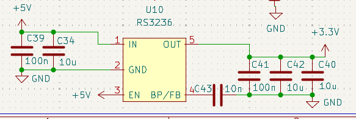

# RS3236 LDO 稳压芯片

[← 返回 MOC](MOC.md)

---

## 芯片简介

低压差线性稳压器（LDO），适用于低噪声、低纹波的小电流场景。

---

## 典型应用

---

## 选型理由

- **低纹波低噪声**：线性稳压，无开关噪声，适合模拟电路、ADC 供电
- **电路简单**：仅需两个电容，PCB 布局简单
- **小封装**：SOT-753 封装，节省空间
- **适用场景**：小电流负载（<300mA），对噪声敏感的电路

---

## 保护特性

- **过流保护**：输出电流超限时限流
- **过温保护**：芯片过热时自动关断
