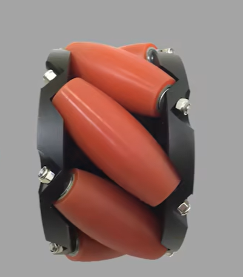

# 麦轮

[← 返回模块总表](../MOC.md) | [← 主页](../../index.md)

---

> 记录麦克纳姆轮（麦轮）的结构原理、运动学解算与跑偏补偿方法。
>
> 代码来源工程：[Intelligent_Agricultural_Equipment_Innovation_Competition](https://github.com/evil0knight/Intelligent_Agricultural_Equipment_Innovation_Competition)（`Mycode/mike.c`）

## 笔记导航

|     主题     |                说明                | 笔记                           |
| :----------: | :--------------------------------: | ------------------------------ |
| 底盘解算程序 | 正解（Vx/Vy/ω → 四轮转速）与逆解 | [底盘解算程序](./底盘解算程序.md) |

---

### 🔴滚子结构

麦轮轮毂外圈均匀分布若干个小滚子，滚子轴线与轮毂轴线成 **45°** 夹角，可沿自身轴线自由滚动。

四个麦轮按 **X 型**排列（左前、右前、左后、右后），左右两侧滚子方向对称，使各轮的侧向分力可以相互叠加或抵消，从而实现全向移动。



---

### 🔴运动学（速度分解）

#### 坐标系约定

以底盘中心为原点，右手坐标系：

- $V_x$：纵向速度（向前为正）
- $V_y$：横向速度（向左为正）
- $\omega$：旋转角速度（逆时针为正）
- $l$：底盘中心到轮子的纵向半距离
- $w$：底盘中心到轮子的横向半距离

<!-- 在此插入坐标系示意图 -->

#### 正解（底盘速度 → 四轮转速）

四轮编号：FL（左前）、FR（右前）、RL（左后）、RR（右后）。

$$
V_{FL} = V_x - V_y - (l+w)\cdot\omega
$$

$$
V_{FR} = V_x + V_y + (l+w)\cdot\omega
$$

$$
V_{RL} = V_x + V_y - (l+w)\cdot\omega
$$

$$
V_{RR} = V_x - V_y + (l+w)\cdot\omega
$$

#### 逆解（四轮转速 → 底盘速度）

$$
V_x = \frac{V_{FL} + V_{FR} + V_{RL} + V_{RR}}{4}
$$

$$
V_y = \frac{-V_{FL} + V_{FR} + V_{RL} - V_{RR}}{4}
$$

$$
\omega = \frac{-V_{FL} + V_{FR} - V_{RL} + V_{RR}}{4(l+w)}
$$

逆解常用于里程计，读取编码器实际转速后反推底盘运动状态。

---

### 🔴跑偏补偿

#### 跑偏成因

- **滚子打滑**：高速平动启动瞬间，滚子从静止切换到随动，存在短暂滑动摩擦，四轮打滑程度不一致导致合力方向偏移。
- **重心偏移**：重心不在几何中心时，四轮压力不均 → 摩擦力不均 → 产生额外偏转力矩。

机械上保证重心居中是根本解；对于重心随工况变化的场景（如带机械臂的工程机器人），需要电控补偿。

#### PID 补偿原理

- **反馈量**：陀螺仪测量的当前角速度 $\omega_{actual}$
- **目标量**：期望角速度 $\omega_{target}$（纯平动时为 0）
- **输出**：叠加到底盘旋转指令上，抵消非期望偏转

```
ω_cmd_compensated = ω_cmd + PID(ω_target - ω_actual)
```
