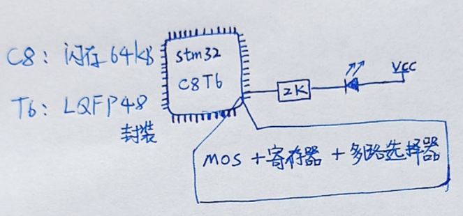
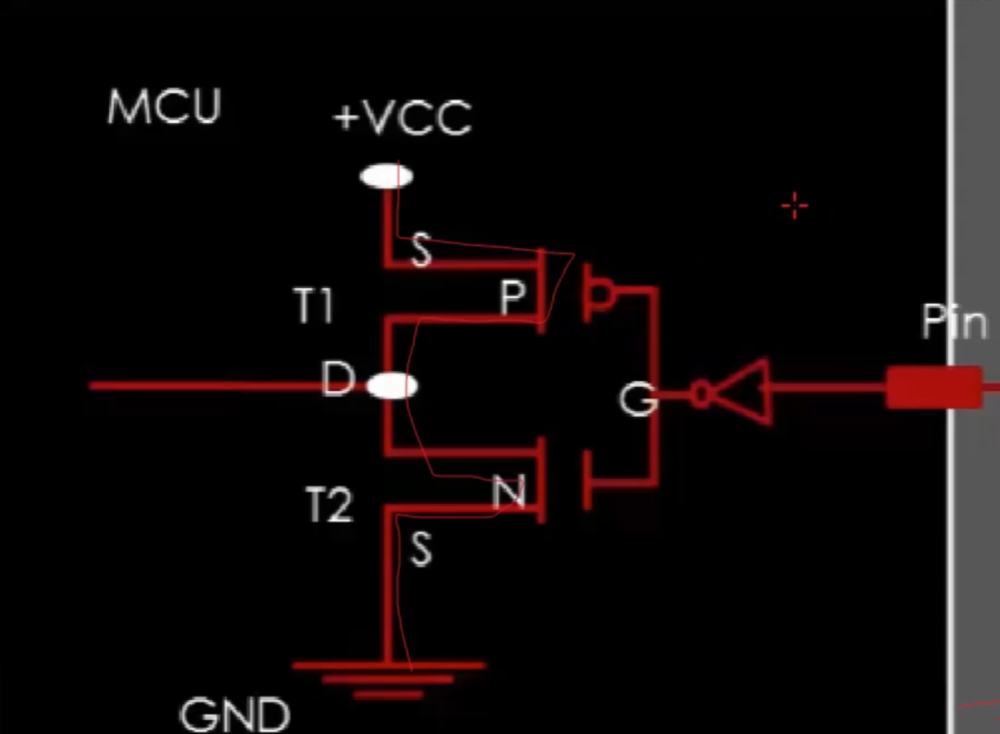
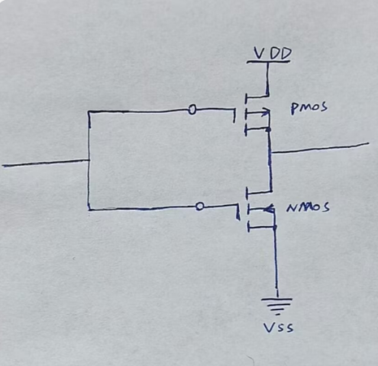
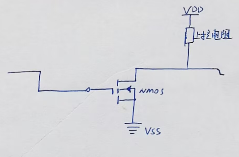
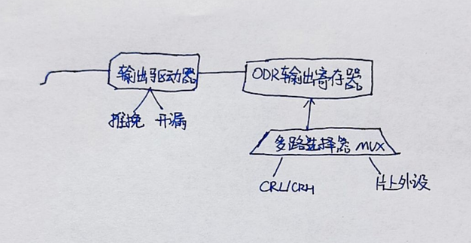

# GPIO：

[← 返回 MOC](MOC.md) | [← 主页](../../index.md)

---

全称 (General Purpose Input/Output)，通用输入输出
GPIO是单片机与外部世界交互最基础、最直接的通道。在后面学习的串口通信，SPI总线，IIC总线，PWM控制电机，它们的物理信号都从GPIO引脚输出输入

## 从电路到编程模型



我们写代码就是往某个内存地址写了个数值，

然后这个值被硬件电路翻译成 MOS的导通/关断

## STM32F1:

一个蓝色小药丸 有48个引脚：VDD、VSS、VBAT、NRST、BOOT0、余GPIO
GPIO分组：A~E，每组16个引脚，16正好是一个16位寄存器的宽度

### 引脚分组

把GPIO组映射到它在内存中的基地址

```
enum class GpioPort : uintptr_t { // enum class: 强枚举, uintptr_t: 平台指针宽度一致
    A = GPIOA_BASE, // 0x40010800  ) 相差1KB
    B = GPIOB_BASE, // 0x40010C00  )
    C = GPIOC_BASE, // 0x40011000
    D = GPIOD_BASE  // 0x40011400
    E = GPIOE_BASE, // 0x40011800
};
```

这些基地址之间间隔是 0x400 (1024字节),中间包含了7个寄存器

### 引脚和寄存器的关系

GPIOC : 0x40011000

#### CRL

> 32位寄存器，高 Pin7 <--- 低 Pin0
> 每4位中 低2位叫MODE:设置输入或输出速度(**压摆率** （Slew Rate）电平响应快慢,上升下降沿是否陡峭)                           	高2位叫CNF:设置上拉？/推挽开漏？

#### CRH

> 与上同

#### IDR

> 输入数据寄存器，低16位有效记录电平状态

#### ODR

> 输出寄存器，操作非原子，直接控制电平
> ↑ 不想被中断，所以设计了 BSRR 和 BRR

#### BSRR

> 低16位：往某位写1，对应ODR设为1，0无影响
> 高16位：往某位写1，对应ODR清零，0无影响
> （原子操作）

#### BRR

> 低16位 写1清除 ODR对应位
> （旧固件使用,现已冗余）

#### LCKR

> 锁定寄存器配置，对应位 CRL / CRH 无法修改
> 初始化后锁定，防止程序跑飞意外修改GPIO导致意外损坏
> 需按照特定的写入序列执行(防止跑飞的时候LCKR也被修改了)

## STM32F4:

#### MODER

> 决定物理引脚的大方向工作模式。
>
> 将引脚独立配置为输入（Input）、输出（Output）、复用功能（Alternate function）或纯模拟状态（Analog）。

#### OSPEEDR

> 控制引脚输出电平跳变的翻转速度（压摆率）。
>
> 可配置为低、中、快、高速。速度越高信号边缘越陡峭，但会带来更高的功耗与电磁干扰（EMI）。

#### OTYPER

> 决定引脚输出信号的硬件驱动结构。
>
> 配置为推挽输出（Push-Pull，具备强高低电平驱动能力）或开漏输出（Open-Drain，需外接上拉电阻，常用于 I2C 等线与逻辑总线）。

#### BSRR

> 专为安全翻转电平设计的原子操作通道。
>
> 往低 16 位的对应位置写 1 可拉高引脚（Set），往高 16 位的对应位置写 1 可拉低引脚（Reset）。单指令周期完成纯写操作，绝对安全，不受任何中断干扰。

#### LCKR

> 锁定当前引脚的各项配置状态。
>
> 必须按照特定的写入时序（密码序列）执行。一旦锁定，直到下一次系统复位前，被锁定位的模式、速度、上下拉等配置都无法再被修改，防止程序跑飞导致硬件损坏。

#### AFRL

> 管理端口中低 8 位引脚（Pin 0 ~ Pin 7）的复用功能映射。
>
> 当引脚在 MODER 中被配置为“复用模式”时，通过此寄存器将物理引脚的控制权交接给特定的芯片内部外设（如将其接通为 USART_TX 或 I2C_SCL）。

#### AFRH

> 管理端口中高 8 位引脚（Pin 8 ~ Pin 15）的复用功能映射。
>
> 功能机制与 AFRL 完全一致，专门负责高位引脚与特定内部外设功能的路由连接。

#### ODR

> 存放 CPU 期望向外输出的电平数据。
>
> 直接修改特定位需要经历底层的“读-改-写”非原子过程，中途若被中断打断极易产生数据覆盖风险。安全做法是使用 **BSRR** 寄存器进行单向且原子的写操作。

#### IDR

> 实时映射物理引脚当前的真实外部电平。仅涉及一次总线读取动作，瞬间获取引脚电平快照。由于该寄存器为只读属性，完全不存在“读-改-写”引发的冲突与篡改可能。

## GPIO的四种工作模式：

**分别为输入、输出、复用功能、模拟模式,CRL,CRH设置**

### 输入：

外部告诉单片机
外部信号电压 ---> 施密特触发器(Schmitt Trigger)进行整形--->输入数据寄存器IDR--->程序读取IDR得知

施密特触发器:把模拟信号变成数字信号,没有中间态
可以设置弱上拉下拉

#### 浮空输入漏电流



如果pin没有弱上拉下拉,也没有施密特触发器,就会导致pin可能在0到3.3之间,那么MOS就会落入饱和区(参考[MOS笔记](../PCB电路/MOS.md)),就会有电流通过,导致漏电流

### 输出：

分为推挽和开漏

#### **推挽：驱动能力强**



#### **开漏:只可拉低，不可拉高,拉高要上拉电阻,IIC会用**

上拉电阻40K

输出模式也可以输入读取



### 复用功能：

**让同一个物理引脚在不同时刻承担不同角色**

当引脚设置为复用功能，引脚将交给对应的片上外设驱动
配置完成后，代码操作 UART 寄存器而不是 GPIO 寄存器

### 模拟模式

用于连接 ADC 和 DAC
施密特触发器被禁用，IDR不再更新（数字电路是干扰源，要关断）
信号 ---> 内部电路 --->ADC
