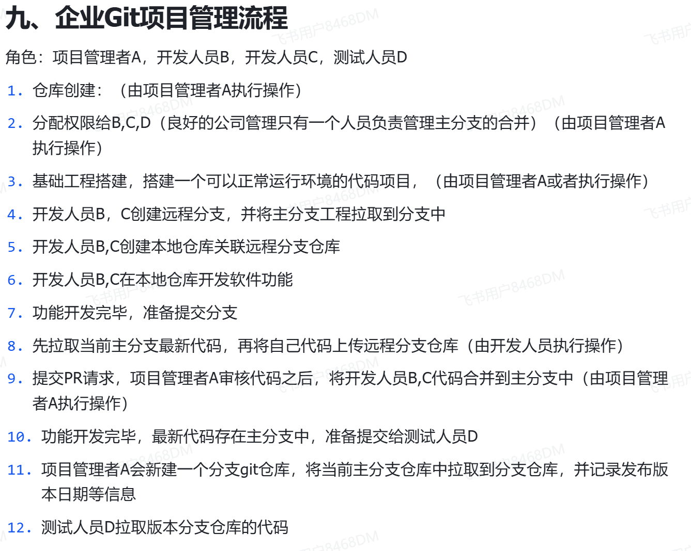

# GIT

[← 返回 MOC](MOC.md) | [← 主页](../index.md)

> [参考教程](https://liaoxuefeng.com/books/git/introduction/index.html),[学习教程](https://learngitbranching.js.org/?locale=zh_CN)

---

## 安装:

直接从Git官网直接[下载安装程序](https://git-scm.com/downloads/win)，然后按默认选项安装即可。安装完成后，在开始菜单里找到“Git”->“Git Bash”，蹦出一个类似命令行窗口的东西，就说明Git安装成功

安装好Git后，还需要最后一步设置，在命令行输入：

```plain
$ git config --global user.name "Your Name"
$ git config --global user.email "email@example.com"
```

因为Git是分布式版本控制系统，所以，每个机器都必须自报家门：你的名字和Email地址。

---

## 创建版本库:

首先，选择一个合适的地方，创建一个空目录：

```plain
$ mkdir learngit
$ cd learngit
$ pwd
/Users/michael/learngit
```

`pwd`命令用于显示当前目录。

第二步，通过 `git init`命令把这个目录变成Git可以管理的仓库：

```plain
$ git init
Initialized empty Git repository in /Users/michael/learngit/.git/
```

---

## 把文件放进去:

一定要放到 `learngit`目录下（子目录也行）

第一步，用命令 `git add`告诉Git，把文件添加到仓库：

```plain
$ git add readme.txt
```

第二步，用命令 `git commit`告诉Git，把文件提交到仓库：

```plain
$ git commit -m "wrote a readme file"
[master (root-commit) eaadf4e] wrote a readme file
 1 file changed, 2 insertions(+)
 create mode 100644 readme.txt
```

简单解释一下 `git commit`命令，`-m`后面输入的是本次提交的说明

多次add,最后commit

---



## 各种git指令及其作用

`git status `    										获取状态

`git config --global core.quotepath false`   			不再转义中文字符,全局设置

---

`git add 文件`										添加文件到待发送区

`git commit`											提交

---

`git branch 新分支名 `    								创建新的分支

`git checkout 新分支名`								切换到新的分支去写

`git checkout 提交的哈希值`							切换到某个提交上去,哈希值只需要前几个字符即可

`git log`    											查找提交的哈希值

`git checkout 分支名^`     								切换提交,不过这个更常用方便

`git checkout 分支名~n`    								切换到某个分支的前N个节点上,上面这些都是对HEAD指针进行操作的

`git branch -f 分支名 节点/分支~n ` 					移动分支的位置,这是对分支操作

---

`git merge 新分支名`									把"新分支名"合并到现在所在的分支上,和下面的git rebase效果一样,这个比较乱,但是写实

`git rebase 新分支名`   								和git merge作用相同,不过用这个的好处是提交历史比较干净,更好看

---

`git reset 分支^`      									本地回退上次

`git revert 分支^`    									远程端回退到上次

---

`git clone`											把远程仓库的代码克隆下来,区别于下载,这包括了.git

`git checkout origin/main`							切换到远程分支,此时提交会HEAD分离,

`git fetch`											下载远程仓库的代码,此时,HEAD没有变,然后用一下git merge就更新了

`git pull`											git fetch+git merge的结合体

`git push`											推送"直到 HEAD 为止的所有新历史"到远程仓库

`git push --set-upstream origin <分支名称> `			创建并推送远程

---
