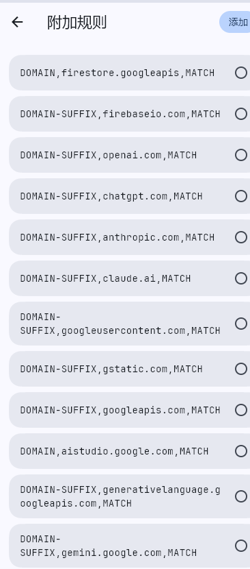

# VPN代理配置

[← 返回配置学习](./MOC.md)

> 一篇更底层的方法:[https://fuwari.oh1.top/posts/Essay/bypass-gfw/](https://fuwari.oh1.top/posts/Essay/bypass-gfw/)

---

梯子:八戒(来自毒药测评),自由猫(小圈子推荐,使用两年了,很可以),梯子要多备几个,这两个梯子质量一般,玩不了TG(😭,也可能是当时配置有问题)

---

## 客户端安装

Windows 上使用 **Clash Verge Rev**

```
GitHub: github.com/clash-verge-rev/clash-verge-rev
下载: Clash.Verge_xxx_x64-setup.exe
```

---

## 基础设置

`设置` 页面：

| 设置项   | 值   | 说明                                       |
| -------- | ---- | ------------------------------------------ |
| 系统代理 | 开启 | 浏览器走代理                               |
| TUN 模式 | 开启 | 虚拟网卡，全局接管所有流量，防 WebRTC 泄露 |
| 服务模式 | 安装 | TUN 前置条件                               |

---

## AI 固定节点分流（全局扩展配置）

**目的**：Gemini/Claude 等 AI 工具检测 IP 频繁跳变会封号。让 AI 域名永远走同一个国家节点。

### 配置文件位置

```
%APPDATA%\io.github.clash-verge-rev.clash-verge-rev\profiles\Merge.yaml
```

就是订阅-->全局扩展覆写配置,然后粘贴底下的代码(这是针对八戒+美国的,其他的机场就把实际节点名换一下就好了)

### 配置内容

```yaml
# ========== 代理组 ==========
proxy-groups:
  - name: "🚀默认"
    type: url-test
    proxies:
      - "🇭🇰香港-Gemini-IEPL"
      - "🇭🇰香港2-IEPL"
      - "🇭🇰香港3-Gemini"
      - "🇹🇼台湾-IEPL"
      - "🇹🇼台湾2-IEPL"
      - "🇸🇬新加坡-Gemini-IEPL"
      - "🇸🇬新加坡2-Gemini-IEPL"
      - "🇸🇬新加坡3-Gemini"
      - "🇯🇵日本-IEPL-GPT"
      - "🇯🇵日本2-IEPL-GPT"
      - "🇯🇵日本3-Gemini"
      - "🇯🇵日本4-IEPL-家宽"
      - "🇺🇸美国-IEPL-GPT"
      - "🇺🇸美国2-IEPL-GPT"
      - "🇩🇪德国-IEPL"
    url: "https://www.gstatic.com/generate_204"
    interval: 600

  - name: "🤖AI专用"
    type: select
    proxies:
      - "🇺🇸美国-IEPL-GPT"
      - "🇺🇸美国2-IEPL-GPT"

# ========== 分流规则 ==========
rules:
  # AI 工具 → 固定美国节点
  - DOMAIN-SUFFIX,claude.ai,🤖AI专用
  - DOMAIN-SUFFIX,anthropic.com,🤖AI专用
  - DOMAIN-SUFFIX,gemini.google.com,🤖AI专用
  - DOMAIN-SUFFIX,generativelanguage.googleapis.com,🤖AI专用
  - DOMAIN-SUFFIX,aistudio.google.com,🤖AI专用
  - DOMAIN-SUFFIX,chatgpt.com,🤖AI专用
  - DOMAIN-SUFFIX,openai.com,🤖AI专用

  # Gemini 依赖的 Google 配套服务
  - DOMAIN-SUFFIX,googleapis.com,🤖AI专用
  - DOMAIN-SUFFIX,accounts.google.com,🤖AI专用
  - DOMAIN-SUFFIX,gstatic.com,🤖AI专用
  - DOMAIN-SUFFIX,googleusercontent.com,🤖AI专用
  - DOMAIN-SUFFIX,firebaseio.com,🤖AI专用
  - DOMAIN-SUFFIX,firestore.googleapis.com,🤖AI专用

  # 其余流量走默认
  - MATCH,🚀默认

```

### 关键规则

| 规则                                     | 说明                               |
| ---------------------------------------- | ---------------------------------- |
| `type: select`                         | 手动选择，**不自动切换**     |
| `proxies` 只放同一国家节点             | 同国内 IP 变化不触发风控，跨国秒封 |
| 节点名必须和机场订阅里**完全一致** | 去 `代理` 页面抄实际节点名       |

---

## 自由猫专用客户端类似:

在附加规则里设置:



选定美国节点不动,开虚拟网卡,Gemini之类的就稳了

---

看视频之类的,买个维云云便宜节点看看就好了,YouTube很宽松
