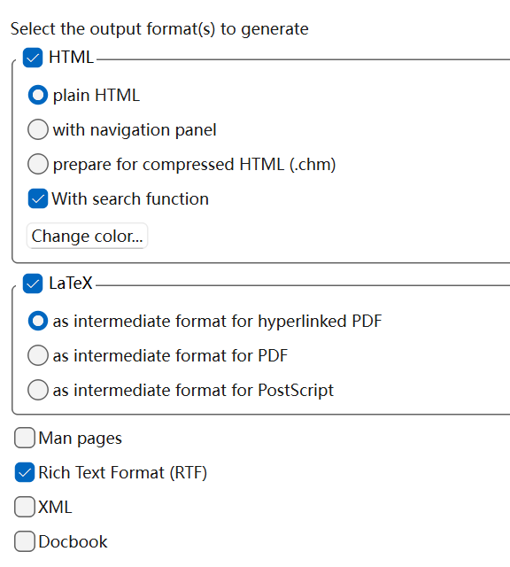

# Doxygen

[← 返回 MOC](MOC.md) | [← 主页](../../index.md)

> 前面是安装,后面是使用,按需跳转

---

## 安装:

MOC里写了下载链接,下载好之后,去搜索栏里搜一下,把快捷方式放到桌面

然后是选择工作区,我选择了 `D:\work_place\doxygen_ws`

---

## 使用:

### 工程配置

* 写工程名,工程描述,版本,图标LOGO,代码选择,然后打钩source code directory,生成文件放到D:\work_place\doxygen_ws
* NEXT之后,选择对C语言优化,
* next之后,
* 再NEXT,保持默认
* 再点击Exepert,要改第一行的编码格式,还有底下的语言要改成中文(Chinese),
* 看左边,点input,改代码编码
* 最后点最顶上的file,去保存一下
* 去RUN那一页,点 `Run doxygen`
* 到HTML那个文件夹里shfit+i快速找到index,点击即可

---

写代码的时候要用固定的注释格式:

### 1. 文件头注释模板（File Header）

通常放在 `.c` 或 `.h` 文件的最顶部。

**C**

```
/**
 * @file    bsp_motor.c
 * @brief   步进电机底层驱动程序（包含定时器 PWM 配置及速度控制）
 * @author  Yang Ao
 * @date    2026-06-08
 * @version V1.0.0
 * @note    本驱动依赖 Timer3 的 Channel 1 和 Channel 2
 */
```

### 2. 函数头注释模板（Function）

通常放在 `.c` 文件中函数实现的上方（或者 `.h` 文件的函数声明上方）。

**C**

```
/**
 * @brief  控制指定电机的转速与方向
 * @note   该函数是非阻塞的，设置后立即返回，速度将在下一次定时器中断中生效
 * @param  motor_idx 电机通道号，取值范围: 0 (左电机), 1 (右电机)
 * @param  speed     目标转速，正数代表正转，负数代表反转，绝对值不超过 1000
 * @retval 0         设置成功
 * @retval -1        电机通道号错误
 * @retval -2        速度参数越界
 */
int Motor_Set_Speed(uint8_t motor_idx, int16_t speed)
{
    // 函数体源码...
    return 0;
}
```

### 3. 结构体与枚举注释模板（Struct & Enum）

在嵌入式开发中，经常需要定义各种状态结构体或寄存器映射，利用 `///<` 可以让结构体在网页中生成极其漂亮的表格。

**C**

```
/**
 * @brief 电机运行状态结构体
 */
typedef struct {
    uint16_t target_speed;  ///< 目标设定转速 (RPM)
    uint16_t current_speed; ///< 当前实际转速 (RPM)
    float    pid_error;     ///< 当前 PID 算法的残差
    uint8_t  is_fault;      ///< 故障标志位：0-正常，1-过流，2-堵转
} Motor_State_T;

/**
 * @brief 电机工作模式枚举
 */
typedef enum {
    MOTOR_MODE_STOP = 0,    ///< 停止模式，断电释放
    MOTOR_MODE_SPEED,       ///< 速度闭环模式
    MOTOR_MODE_POSITION     ///< 位置闭环（位置环）模式
} Motor_Mode_E;
```

## 💡 进阶小技巧

1. **多行简要描述** ：如果 `@brief` 后面一句话写不下，可以直接换行接着写，直到遇到一个空行，或者遇到下一个 `@` 标签，Doxygen 会自动把这一整段都识别为简要描述。
2. **支持 Markdown** ：Doxygen 完美支持 Markdown 语法。你可以在注释里直接写 `加粗`、`*斜体*`、甚至是使用 `- ` 来写无序列表，生成的网页会自动渲染。

---

## 功能:

汇报用
