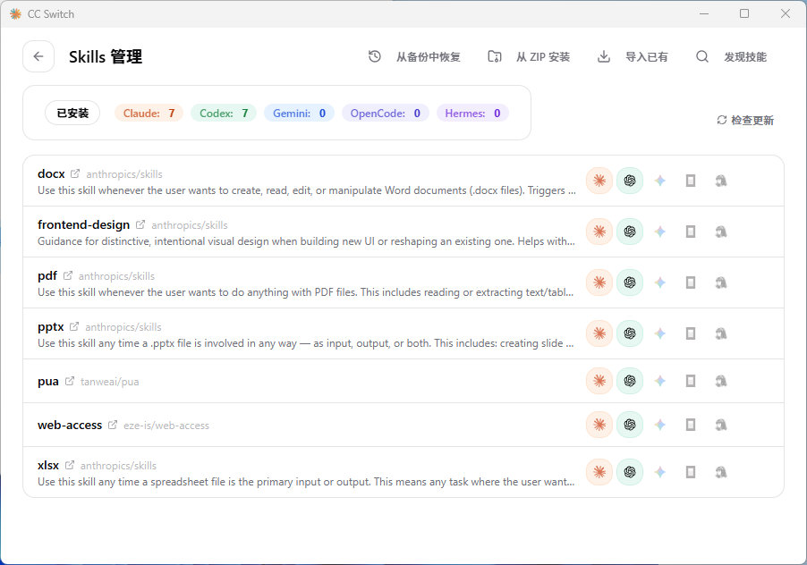

# **SKILL的知识地图**

[←返回配置学习MOC
](../MOC.md)

> [来自知乎
> ](https://zhuanlan.zhihu.com/p/2021964866966025168?share_code=YodIFyyqksLp&utm_psn=2050994430140851900)

---

## **Frontend Design**

写前端用的,前端审美提高

## **docx、xlsx、pdf、pptx**

办公用

## **Web Access Skill**

真正有了联网搜索的能力,强推

## **PUA**

agent兴奋剂,最后时刻的放手一搏,可以跳出固有思维,减少agent偷懒,很有意思也有点用
